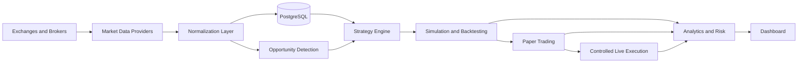
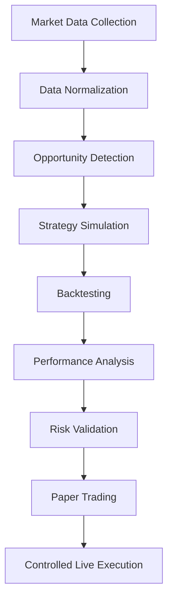

# Architecture

## High-level overview

Quant Lab is a Turborepo monorepo organized around a small set of applications and focused packages. The architecture keeps venue-specific code, strategy logic, simulation, persistence, and orchestration separate so each concern can evolve independently.

## Applications

- `apps/api`: NestJS orchestration API. Exposes read models, control endpoints, configuration surfaces, and platform capability endpoints.
- `apps/worker`: long-running jobs, ingestion, normalization, backtests, simulations, queue consumers, and scheduled workflows.
- `apps/dashboard`: Next.js operator and research UI. Surfaces data, experiments, reports, and execution state.

## Packages

- `packages/core`: domain entities, value objects, enums, and shared domain contracts.
- `packages/market-data`: `MarketDataProvider` abstractions, normalization helpers, and exchange adapters.
- `packages/strategy-engine`: strategy lifecycle, plugin loading, signal generation, and portfolio rules.
- `packages/paper-trading`: simulated orders, fills, balances, positions, and portfolio evolution.
- `packages/analytics`: performance, risk, attribution, and reporting primitives.
- `packages/execution`: `ExecutionProvider` abstractions and live or simulated routing adapters.
- `packages/shared`: reusable utilities, types, validation helpers, and cross-cutting primitives.

## Dependency boundaries

- Strategies depend on core contracts and provider interfaces, not on CCXT, Prisma, NestJS, HTTP, WebSockets, or database details.
- Venue adapters depend on shared contracts, not on strategy implementations.
- Persistence adapters translate domain objects into PostgreSQL records; they do not own trading rules.
- The dashboard consumes API contracts and read models; it does not talk directly to venues or databases.
- The worker owns long-running and stateful tasks; the API remains focused on orchestration and request/response flows.

## Provider and adapter model

CCXT is the first integration layer for Binance and Kraken. The platform should expose stable architectural contracts such as `MarketDataProvider`, `HistoricalDataProvider`, and `ExecutionProvider`, with venue-specific behavior isolated behind adapters.

Future IBKR support should fit the same model even though the brokerage domain differs from crypto exchanges.

## Strategy plugin model

Strategies should be loadable as isolated modules with explicit configuration schemas and versioned metadata. A strategy plugin should declare:

- a stable name and version;
- required inputs and parameters;
- supported markets and venues;
- signal and risk outputs;
- execution assumptions;
- experiment metadata hooks.

This makes strategy code testable and prevents it from depending on infrastructure internals.

## Research lifecycle flow

Each step should persist enough metadata to make the next step reproducible.

## Simulation and execution boundaries

- Simulation models market interaction without pretending the observed price is always executable.
- Paper trading reuses execution semantics where practical, but the fill source is simulated.
- Controlled live execution is gated, auditable, and disabled by default.
- Order, fill, position, and portfolio semantics should stay compatible across paper and live paths.

## Persistence boundaries

PostgreSQL and Prisma store normalized market data, instruments, opportunities, experiments, backtests, paper-trading state, and audit records. The database layer is infrastructure, not strategy logic.

## Observability concerns

The platform should treat observability as a first-class design constraint:

- structured logs through Pino;
- metrics for ingestion lag, strategy runs, order lifecycle, and risk events;
- traceable correlation IDs across API and worker paths;
- connection-health visibility for each venue;
- alerts for job failures, stale feeds, and execution anomalies.

## Future queue and worker architecture

Redis and BullMQ are planned for durable background-job orchestration. The queue layer should support:

- market data ingestion jobs;
- historical replay jobs;
- backtest execution jobs;
- paper-trading event processing;
- alert and reconciliation jobs.

The worker should remain the execution boundary for long-running jobs even if queue technology changes later.

## Future broker support

IBKR is a future broker integration target. The current architecture should preserve:

- venue abstraction boundaries;
- order and fill model compatibility;
- instrument normalization that can handle non-crypto assets;
- support for market hours, contract specifications, and account constraints.
