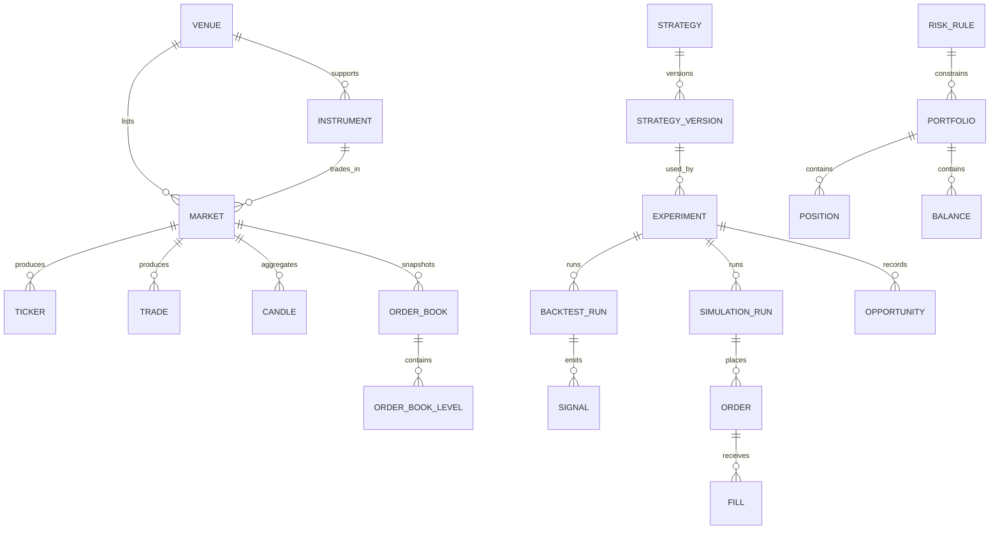

# Domain Model

This document describes the intended domain model at a conceptual level. It does not define the final Prisma schema.

## Venue

| Field | Detail |
| --- | --- |
| Responsibility | Represents a tradable endpoint that exposes market data, execution, or both. |
| Important fields | `id`, `name`, `type`, `status`, `code`, `metadata`. |
| Relationships | Owns markets and instruments; specialized by `Exchange` and `Broker`. |
| Invariants | A venue must have a stable identifier and an explicit type. |

## Exchange

| Field | Detail |
| --- | --- |
| Responsibility | Specialization of `Venue` for exchange-native market trading. |
| Important fields | `venueId`, `spotSupported`, `derivativesSupported`, `feeMetadata`. |
| Relationships | Used by `MarketDataProvider` and `ExecutionProvider` adapters. |
| Invariants | Must expose normalization rules and market metadata that can be versioned. |

## Broker

| Field | Detail |
| --- | --- |
| Responsibility | Specialization of `Venue` for broker-mediated instruments and account-based trading. |
| Important fields | `venueId`, `accountModel`, `marketHours`, `contractMetadata`. |
| Relationships | Future support target for IBKR and other broker integrations. |
| Invariants | Must preserve contract, session, and account semantics accurately. |

## Instrument

| Field | Detail |
| --- | --- |
| Responsibility | Canonical tradable asset or contract definition. |
| Important fields | `id`, `type`, `baseCurrency`, `quoteCurrency`, `symbol`, `precision`, `minimumSize`. |
| Relationships | Belongs to a venue and may appear in many markets over time. |
| Invariants | Symbol normalization must be deterministic; precision and minimum size must be respected. |

## Market

| Field | Detail |
| --- | --- |
| Responsibility | A tradable pair or contract on a specific venue. |
| Important fields | `id`, `venueId`, `instrumentId`, `symbol`, `status`, `tradingMode`. |
| Relationships | Produces tickers, trades, candles, and order books. |
| Invariants | A market symbol is venue-specific and cannot be assumed portable. |

## Ticker

| Field | Detail |
| --- | --- |
| Responsibility | Best available current quote snapshot. |
| Important fields | `marketId`, `bid`, `ask`, `last`, `timestamp`, `source`. |
| Relationships | Belongs to a market and is used in opportunity detection. |
| Invariants | Timestamp must be known; stale data should be identifiable. |

## Trade

| Field | Detail |
| --- | --- |
| Responsibility | An executed trade event from a venue feed. |
| Important fields | `marketId`, `price`, `size`, `side`, `timestamp`, `tradeId`. |
| Relationships | Used for normalization, replay, and analytics. |
| Invariants | Trade ordering and timestamp consistency matter for replay. |

## Candle

| Field | Detail |
| --- | --- |
| Responsibility | Aggregated OHLCV bar for a market and interval. |
| Important fields | `marketId`, `interval`, `open`, `high`, `low`, `close`, `volume`, `startTime`, `endTime`. |
| Relationships | Derived from trades or provided directly by a venue. |
| Invariants | Time bucket boundaries must be consistent and non-overlapping. |

## OrderBook

| Field | Detail |
| --- | --- |
| Responsibility | Snapshot or delta representation of available liquidity. |
| Important fields | `marketId`, `sequence`, `timestamp`, `asks`, `bids`. |
| Relationships | Contains `OrderBookLevel` rows and supports depth/slippage modeling. |
| Invariants | Bid and ask ladders must be price ordered and internally consistent. |

## OrderBookLevel

| Field | Detail |
| --- | --- |
| Responsibility | A single price level in an order book. |
| Important fields | `side`, `price`, `size`, `depthIndex`. |
| Relationships | Child element of an `OrderBook`. |
| Invariants | Must be positive and ordered according to side. |

## FeeSchedule

| Field | Detail |
| --- | --- |
| Responsibility | Encodes maker, taker, withdrawal, and other venue costs. |
| Important fields | `venueId`, `makerFee`, `takerFee`, `withdrawalFees`, `tier`. |
| Relationships | Used by backtesting, opportunity evaluation, and execution planning. |
| Invariants | Fees must be versioned because they change over time. |

## Opportunity

| Field | Detail |
| --- | --- |
| Responsibility | A detected candidate trade or arbitrage situation. |
| Important fields | `strategyId`, `marketPair`, `observedProfit`, `executableProfit`, `timestamp`, `confidence`. |
| Relationships | Produced by detection logic and consumed by strategies and experiments. |
| Invariants | Observed profit is not executable profit. |

## Signal

| Field | Detail |
| --- | --- |
| Responsibility | Strategy output that expresses intent or action. |
| Important fields | `strategyVersionId`, `side`, `size`, `confidence`, `reason`, `timestamp`. |
| Relationships | Can lead to simulation, paper, or live orders. |
| Invariants | Must be derived from a known strategy version and configuration. |

## Strategy

| Field | Detail |
| --- | --- |
| Responsibility | A strategy family or logical approach. |
| Important fields | `id`, `name`, `description`, `category`. |
| Relationships | Owns multiple `StrategyVersion` records. |
| Invariants | Strategy identity should remain stable even as implementations evolve. |

## StrategyVersion

| Field | Detail |
| --- | --- |
| Responsibility | Immutable version of a strategy implementation and configuration schema. |
| Important fields | `strategyId`, `version`, `commitSha`, `configSchema`, `status`. |
| Relationships | Used by experiments, backtests, and paper trading. |
| Invariants | A version should not be mutated after publication. |

## Experiment

| Field | Detail |
| --- | --- |
| Responsibility | A reproducible research run with explicit parameters. |
| Important fields | `id`, `strategyVersionId`, `datasetId`, `parameters`, `startTime`, `endTime`, `status`. |
| Relationships | Owns backtest and simulation runs; references code and dataset versions. |
| Invariants | Must be reproducible from stored metadata. |

## BacktestRun

| Field | Detail |
| --- | --- |
| Responsibility | Historical simulation of a strategy over a dataset. |
| Important fields | `experimentId`, `datasetRange`, `fillModel`, `feeModel`, `slippageModel`, `metrics`. |
| Relationships | Part of an experiment and feeds analytics. |
| Invariants | Inputs and model assumptions must be persisted. |

## SimulationRun

| Field | Detail |
| --- | --- |
| Responsibility | Deterministic replay or simulated runtime execution. |
| Important fields | `experimentId`, `simulationClock`, `eventLog`, `resultSummary`. |
| Relationships | Can produce orders, fills, and portfolio changes. |
| Invariants | The same event stream and parameters should produce the same output. |

## Order

| Field | Detail |
| --- | --- |
| Responsibility | Intent to trade at a venue or through a broker. |
| Important fields | `id`, `marketId`, `side`, `type`, `quantity`, `price`, `status`, `clientOrderId`. |
| Relationships | Produces fills and is linked to a strategy or operator action. |
| Invariants | Must respect market precision, minimum size, and risk rules. |

## Fill

| Field | Detail |
| --- | --- |
| Responsibility | Partial or complete execution of an order. |
| Important fields | `orderId`, `price`, `quantity`, `fee`, `timestamp`, `fillId`. |
| Relationships | Aggregates into positions and portfolio updates. |
| Invariants | Total filled quantity cannot exceed order quantity. |

## Position

| Field | Detail |
| --- | --- |
| Responsibility | Current holding for an instrument or contract. |
| Important fields | `portfolioId`, `instrumentId`, `quantity`, `averageCost`, `unrealizedPnl`. |
| Relationships | Part of a portfolio and updated by fills. |
| Invariants | Quantity sign and valuation conventions must be consistent. |

## Portfolio

| Field | Detail |
| --- | --- |
| Responsibility | Aggregate view of balances, positions, and exposure. |
| Important fields | `id`, `name`, `baseCurrency`, `equity`, `exposure`, `pnl`. |
| Relationships | Contains balances and positions; constrained by risk rules. |
| Invariants | Portfolio totals must reconcile to underlying balances and positions. |

## Balance

| Field | Detail |
| --- | --- |
| Responsibility | Available and reserved capital for a currency or account. |
| Important fields | `portfolioId`, `currency`, `available`, `locked`, `total`. |
| Relationships | Used by paper trading and live execution. |
| Invariants | Available plus locked should equal total within precision rules. |

## RiskRule

| Field | Detail |
| --- | --- |
| Responsibility | Constraint applied to strategies, orders, portfolios, or venues. |
| Important fields | `id`, `type`, `limit`, `scope`, `enabled`. |
| Relationships | Evaluated before simulation, paper trading, and live execution. |
| Invariants | If a rule is violated, execution must be blocked or reduced according to policy. |
